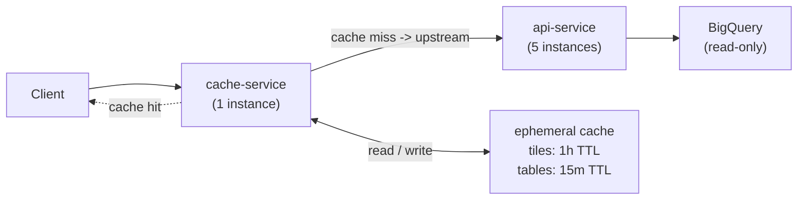

# Part 1 - Local Development Environment

## Overview

This solution introduces a containerised local development environment that is consistent across Linux and macOS. The goal is to eliminate OS-specific differences, stabilise dependency resolution, and provide a reproducible setup that any developer can run with minimal prerequisites.

It includes a multi-stage `Dockerfile`, a `Docker Compose` service definition, and a `Makefile` to simplify common workflows. The optional step is covered by a replication script (`scripts/replicate-osm-buildings.sh`) invocable via `make replicate`.

### `Dockerfile`

The image is built in four named stages to keep the final artifact lean and secure:

| Stage | Base | Purpose |
| :--- | :--- | :--- |
| `base` | `node:22-trixie-slim` | Shared foundation; enables Corepack (Yarn) |
| `deps` | `base` | Installs all dependencies (dev and prod) against a lockfile |
| `build` | `deps` | Compiles TypeScript to `dist/` |
| `prod-deps` | `base` | Re-installs production-only dependencies |
| `runtime` | `distroless/nodejs22-debian13:nonroot` | Final image; no shell or package manager, runs as non-root |

The `runtime` stage copies only `node_modules` (prod) and `dist/` from their respective stages, so no source code, dev tooling, or build cache reaches the final image. Using a distroless base further reduces the attack surface and image size.

`NODE_VERSION` is parameterised via `ARG` so it can be overridden at build time without editing the file.

### `compose.yaml`

A single `api` service that:

- Builds from `services/api/` using the Dockerfile above.
- Exposes port `3000` on the host.
- Loads secrets and service config from `services/api/.env` (not committed to version control).
- Injects `NODE_ENV=development` at the compose level, keeping it separate from `.env` so environment-specific values are not accidentally promoted to production.
- Uses `restart: unless-stopped` to survive daemon restarts during a workday without requiring manual intervention.

### `Makefile`

A thin convenience layer; all targets delegate to either `docker compose` or the local `yarn` scripts. No logic lives here.

```makefile
make build        # Build the image
make up           # Build and start the service in detached mode
make down         # Stop and remove containers and volumes
make logs         # Stream logs
make restart      # Restart the api container
make shell        # Open a shell inside the container
make lint         # Run the linter locally
make test         # Run unit tests locally
make test-watch   # Run tests in watch mode
make clean        # Remove dist/, node_modules/, and Yarn cache
make replicate    # Run the BQ table replication script
```

`lint`, `test`, and `test-watch` intentionally run on the host (via the local Yarn install) rather than inside the container to keep the feedback loop fast during development. They can be moved into the container if a fully hermetic environment is preferred.

## Usage

### Prerequisites

- `docker`
- Docker Compose plugin
- GNU `make`

```bash
# First run
cp services/api/.env.example services/api/.env  # populate credentials
make up

# Daily workflow
make logs       # tail logs
make shell      # inspect or debug the running container
make restart    # apply a .env change without a full rebuild
make down       # tear everything down at end of day
```

## BigQuery table replication

This [script](scripts/replicate-osm-buildings.sh) leverages the `bq` CLI to create a stable copy of `carto-demo-data.demo_tilesets.osm_buildings` in a target dataset. It requires either Application Default Credentials or an active `gcloud` login in the environment.

The `bq mk --dataset ... || true` check ensures the destination dataset exists, making the script idempotent and safe to run multiple times. Next, the table is copied, overwriting the destination to keep it fully synchronised with the source. The `bq cp --force` flag ensures atomic overwrites, so readers always see a complete, consistent snapshot (never a partial state). The `--no_async` option blocks until the copy job completes, enabling safe chaining or retries in workflows.

Re-running the script will overwrite the existing copy, making it suitable for recurring refresh workflows.

### Scheduling with cron

The script can be scheduled for recurring execution using cron. For example, to run nightly at 02:00 UTC:

```bash
0 2 * * * BQ_DEST_PROJECT=<PROJECT_ID> /path/to/replicate-osm-buildings.sh >> /var/log/bq-replica.log 2>&1
```

For fully managed execution, a GCP-native alternative is using Cloud Scheduler with Cloud Run jobs.

# Part 2 - CI/CD

## Overview

This module implements a robust, automated CI/CD pipeline using GitHub Actions. It ensures code quality, security compliance, and reliable deployment across three distinct environments (`dev`, `stg`, `prod`) on Google Cloud. Infrastructure is managed as code with OpenTofu.

The pipeline is designed around a modular, reusable workflow structure to minimise duplication and maximise maintainability. It is also path-filtered and change-aware: only the services that actually changed are built and promoted, keeping run times and costs proportional to the work done.

## Technologies

| Concern | Tool |
| :--- | :--- |
| CI/CD orchestration | GitHub Actions |
| Container registry | Google Artifact Registry |
| Runtime | Google Cloud Run |
| Infrastructure as Code | OpenTofu (open-source Terraform fork) |
| Google Cloud auth | Workload Identity Federation (keyless) |
| Vulnerability scanning | Trivy -> GitHub Security tab (SARIF) |
| Versioning | semantic-release (Conventional Commits) |

## Workflow structure

The pipeline is decomposed into several specialised workflows:

```text
.github/
├── actions/
│   ├── setup-gcloud/     # Composite: WIF auth + gcloud SDK
│   └── setup-node/       # Composite: Node + Yarn cache
└── workflows/
    ├── ci.yml            # Main entry point (PR + push to main)
    ├── _build.yml        # Reusable: build, push, scan image
    ├── _deploy.yml       # Reusable: deploy to a single environment
    ├── cd.yml            # Manual / event-driven deploy escape hatch
    ├── release.yml       # Semantic versioning on main
    └── infra.yml         # OpenTofu plan (PR) + apply (main)
```

## CI/CD flow

### 1. Development and validation

- **Trigger**: A developer opens a Pull Request (PR) against `main`.
- **Path Filtering**: The pipeline identifies which services (`api`, `cache`) have been modified using `dorny/paths-filter`.
- **Validation**: For affected services, the pipeline executes:
  - Linting (`yarn lint`)
  - Unit tests (`yarn test`)
  - Infrastructure plan (`tofu plan`) for any IaC changes.
- **Security**: If code is pushed to `main`, the container image is built and scanned for critical/high vulnerabilities using Trivy.

### 2. Build and publish

- **Trigger**: Merge to `main`.
- **Action**: The `_build.yml` workflow is invoked.
- **Process**:
  1. Authenticates with Google Cloud using Workload Identity Federation (WIF).
  2. Builds the Docker image with layered caching via GitHub Actions Cache.
  3. Pushes the immutable image to Artifact Registry, tagged with the commit SHA.
  4. Outputs the image digest for downstream deployment.

### 3. Deployment strategy

The deployment follows a progressive, environment-based promotion strategy: `dev` is automatically deployed immediately after a successful build, `stg` only deploys after `dev` succeeds, and `prod` only after `stg`. Each environment is also a [GitHub Environment](https://docs.github.com/en/actions/deployment/targeting-different-environments), enabling per-environment secrets, protection rules, and an optional manual approval gate before `prod`. This sequential dependency (`needs: [build, deploy-stg]`) ensures that untested code never reaches production.

- **Concurrency control**:
  Each environment has a dedicated concurrency group. This prevents overlapping deployments to the same environment, ensuring state consistency. `cancel-in-progress: false` ensures a queued deploy waits rather than being dropped.

- **Manual / hotfix deploys**:
  `cd.yml` exposes a `workflow_dispatch` trigger that accepts an environment, digest, and service as inputs. This allows deploying a specific image digest to any environment without going through the full pipeline - useful for rollbacks or emergency hotfixes.

## Authentication (Workload Identity Federation)

Instead of storing long-lived Google Cloud service account keys, the pipeline authenticates via Workload Identity Federation.

GitHub's OIDC token is exchanged for a short-lived Google Cloud access token scoped to a dedicated service account. Credentials exist only for the duration of the job, significantly reducing the risk of credential leakage.

# Part 3 - Deployment

## Overview

The infrastructure required to deploy the API and its caching layer is provisioned on Google Cloud using OpenTofu (Terraform-compatible). Each environment (`dev`, `stg`, `prod`) is an isolated Google Cloud project with its own service accounts, Artifact Registry repository, and Cloud Run services. The IaC is structured as a root module with three reusable child modules, driven by per-environment `.tfvars` files.

| OpenTofu was chosen over Terraform because it remains fully open source, whereas Terraform switched to the BSL license. OpenTofu offers identical functionality and compatibility with Terraform, while maintaining vendor neutrality and an open-source license.

## Architecture

The deployment consists of two services, each running as a managed Cloud Run instance:

1. **API service**: The core NestJS application serving BigQuery geospatial data.
2. **Cache service**: A dedicated caching layer positioned in front of the API to reduce latency and load on the backend.



All traffic enters through the cache service. On a cache miss the cache proxies to the API; the API queries BigQuery and returns the result, which the cache stores for subsequent requests.

Each service runs under a dedicated service account with the minimum required IAM roles (log writer, metric writer, Artifact Registry reader).

### API caching

The cache container uses Nginx as a reverse proxy with response caching (`proxy_cache`).

Nginx was chosen (over Redis or a dedicated HTTP cache like Varnish) because the API is a read-only layer serving large, infrequently updated GeoJSON or binary tiles, making it ideal for HTTP-level caching.

It requires no additional dependencies and can cache large tile data on disk, serving it at memory speed without involving the Cloud Run API service.

This simplifies the architecture, requiring just one container and configuration.

#### Invalidation strategy

Given the read-only nature of the underlying BigQuery tilesets and their infrequent changes, a Time-To-Live (TTL) based invalidation strategy is sufficient.

Responses include a `Cache-Control: max-age` header, with values like `3600` seconds (1h) for tiles. Nginx automatically evicts stale entries based on this header, ensuring eventual consistency with any upstream data updates without requiring complex mechanisms.

> If data updates become more frequent, a more targeted invalidation approach, like a `PURGE` endpoint or cache-key prefix wipe triggered by a BigQuery event, could be implemented.

## Infrastructure components

```text
infra/
├── main.tf               # Root: wires modules together
├── variables.tf
├── outputs.tf
├── providers.tf
├── environments/
│   ├── dev.tfvars
│   ├── stg.tfvars
│   └── prod.tfvars
└── modules/
    ├── cloud_run_service/ # Generic Cloud Run service definition
    ├── artifact_registry/ # Docker repository
    └── iam/               # Service account + role bindings
```

The codebase is structured into reusable modules to enforce separation of concerns:

- **`modules/cloud_run_service`**: Provisions the Cloud Run v2 service, configuring scaling, health checks, environment variables, and IAM permissions. It uses startup probes to ensure traffic is only routed to ready instances.
- **`modules/iam`**: Manages Service Accounts with least-privilege access. Each service gets a dedicated account with permissions limited to logging, monitoring, and reading from Artifact Registry.
- **`modules/artifact_registry`**: Creates the private container registry repository for storing service images.
- **`main.tf`**: Orchestrates the modules, enabling required GCP APIs and wiring dependencies between services (for example, passing the API URL to the Cache).

## Usage

### Prerequisites

- `tofu` >= 1.5 (or `terraform` >= 1.5 - state format is compatible)
- `gcloud` authenticated with permissions to manage Cloud Run, IAM, and Artifact Registry in each target project
- A GCS bucket for remote state (set via `-backend-config`)

### Setup

```bash
cd infra

tofu init \
  -backend-config="bucket=<YOUR_TF_STATE_BUCKET>" \
  -backend-config="project=<GCP_PROJECT_ID>" \
  -backend-config="prefix=infra/<ENVIRONMENT>.tfstate"

tofu plan -var-file=environments/<ENVIRONMENT>.tfvars
tofu apply -var-file=environments/<ENVIRONMENT>.tfvars
```

Replace `<ENVIRONMENT>` with `dev`, `stg`, or `prod`.

### Outputs

Upon successful application, the public URLs for the services are printed:

- `api_url`: The endpoint for the geospatial API.
- `cache_url`: The endpoint for the cached API responses.

Use `cache_url` as the public entry point. Direct API traffic through the cache in all environments.

# Part 4 - Production Readiness

When transitioning from a prototype to a production-grade system, it’s important to focus on security, resilience, and observability. The following areas are key to ensuring the system is production-ready.

## Network security

The Cloud Run services should be limited to internal-only ingress. Traffic should route through a Global External HTTP(S) Load Balancer with Cloud CDN. This setup ensures DDoS protection, handles SSL termination, and provides edge caching for static vector tiles, which helps reduce latency and offload the backend. For inter-service communication (e.g., cache to API), use a Serverless VPC Connector with private IPs to ensure data remains within the private network and doesn’t go over the public internet.

## IAM

It's essential to eliminate hardcoded environment variables for sensitive data. All secrets should be managed with secrets manager (e.g., Google Secret Manager, HashiCorp Vault) and injected at runtime or mounted as volumes. To ensure the integrity of the supply chain, enable Binary Authorization so that only images signed by the CI pipeline can be deployed. It's also important to regularly audit IAM policies to make sure each service has only the permissions it needs, following the principle of least privilege.

## Reliability

The system should be able to handle failures gracefully. Implement graceful shutdown logic to drain active requests upon receiving a `SIGTERM`, preventing 502 errors during scaling or deployments. For the cache layer, use retry logic with exponential backoff and a circuit breaker to avoid cascading failures if the API becomes unresponsive. Health checks should go beyond simple connectivity checks—ensure that dependencies are verified so only fully functional instances receive traffic.

## Observability

In production, basic logging won’t cut it. Implement structured JSON logging to make parsing easier in Cloud Logging. Use OpenTelemetry for distributed tracing to track latency across the Cache-API-BigQuery pipeline. Set up SLO-based alerts for error rates and P95 latency. Additionally, export custom business metrics (like tile request volume) to Cloud Monitoring for better insight and faster incident response.

## Cost optimization

Running direct queries to BigQuery for every request can be expensive and slow. Swap the single-instance cache for Memorystore for Redis to provide shared, high-throughput state across multiple instances. For frequently accessed spatial datasets, use BigQuery Materialized Views to reduce query costs. To minimize the impact of potential defects during deployments, implement canary deployments with Cloud Run's traffic splitting feature to test new releases with a small subset of users before rolling them out to everyone.
