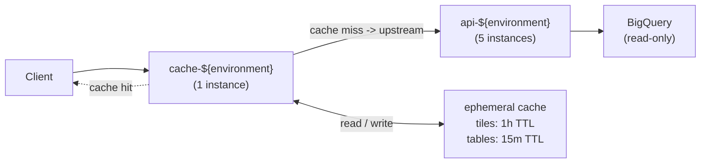

# Part 1 - Local Development Environment

## Overview

A containerised local environment that is consistent across Linux and macOS. It uses a multi-stage Dockerfile, Docker Compose, and a Makefile to provide a reproducible setup with minimal prerequisites.

The optional step is covered by a [replication script](scripts/replicate-osm-buildings.sh) invocable via `make replicate`.

## Components

### [Dockerfile](services/api/Dockerfile)

Four build stages produce a minimal, secure runtime image:

| Stage | Base | Purpose |
| :--- | :--- | :--- |
| `base` | `node:22-trixie-slim` | Enables Corepack (Yarn) |
| `deps` | `base` | Installs dependencies from lockfile |
| `build` | `deps` | Compiles TypeScript to `dist/` |
| `prod-deps` | `base` | Re-installs production-only dependencies |
| `runtime` | `distroless/nodejs22-debian13:nonroot` | Final image; non-root, no shell |

Only `node_modules` (prod) and `dist/` are copied to the runtime stage. `NODE_VERSION` is parameterised via `ARG` for build-time overrides.

### [compose.yaml](compose.yaml)

Single `api` service configuration:

- Builds from `services/api/` using the Dockerfile above.
- Exposes port `3000` on the host.
- Loads environment variables (`GOOGLE_APPLICATION_CREDENTIALS`, `MAX_JSON_RESPONSE_SIZE`) from a `.env` file (not committed to version control).
- Injects `NODE_ENV=development` at the compose level, keeping it separate from `.env` so environment-specific values are not accidentally promoted to production.
- Mounts a volume for synchrozing local `src` with the container and persists `node_modules` to avoid reinstalling modules on every container restart.
- Uses `restart: unless-stopped` to survive daemon restarts during a workday without requiring manual intervention.

> Mount the service account JSON file as a volume or set `GOOGLE_APPLICATION_CREDENTIALS` to a local path.

### [Makefile](Makefile)

Thin wrapper around `docker compose` and `yarn`:

```makefile
make build        # Build image
make up           # Start service (detached)
make down         # Stop and remove containers/volumes
make logs         # Stream logs
make restart      # Restart container
make shell        # Open shell in container
make lint         # Run linter (host)
make test         # Run tests (host)
make test-watch   # Run tests in watch mode (host)
make clean        # Remove dist/, node_modules/, cache
make replicate    # Run BigQuery replication script
```

Lint and test targets run on the host for faster feedback. Move them into the container if a fully hermetic environment is required.

## Usage

### Prerequisites

- Docker with Compose plugin
- GNU Make

### First run

```bash
cp services/api/.env.example services/api/.env
# Edit .env with your credentials
make up
```

### Test

```bash
curl http://localhost:3000/
curl "http://localhost:3000/maps/table/carto-demo-data.demo_tables.retail_stores?geomField=geom&format=geojson"
```

### Daily workflow

```bash
make logs       # Tail logs
make shell      # Debug running container
make restart    # Apply .env changes
make down       # Tear down at end of day
```

## BigQuery table replication

The [script](scripts/replicate-osm-buildings.sh) copies `carto-demo-data.demo_tilesets.osm_buildings` to a target dataset using the `bq` CLI. It requires Application Default Credentials or an active `gcloud` login.

**Key features**:
- Idempotent: creates destination dataset if missing (`bq mk --dataset ... || true`)
- Atomic: `bq cp --force` overwrites the destination safely, so readers always see a complete, consistent snapshot (never a partial state)
- Synchronous: `--no_async` blocks until completion for reliable chaining

> Re-running the script will overwrite the existing copy, making it suitable for recurring refresh workflows.

### Scheduling

The script can be scheduled for recurring execution via cron. For example, to run nightly at 02:00 UTC:

```bash
0 2 * * * BQ_DEST_PROJECT=<PROJECT_ID> /path/to/replicate-osm-buildings.sh >> /var/log/bq-replica.log 2>&1
```

For fully managed execution, a GCP-native alternative is using Cloud Scheduler with Cloud Run jobs.

# Part 2 - CI/CD

## Overview

Automated CI/CD via GitHub Actions. Ensures code quality, security scanning, and sequential promotion across `dev`, `stg`, `prd` on Google Cloud. Infrastructure is managed with OpenTofu.

Path filtering ensures only changed services (`api`, `cache`) or infrastructure trigger relevant workflows.

## Technologies

| Concern | Tool |
| :--- | :--- |
| Orchestration | GitHub Actions |
| Registry | Google Artifact Registry |
| Runtime | Google Cloud Run |
| IaC | OpenTofu |
| Auth | Workload Identity Federation |
| Scanning | Trivy (CRITICAL/HIGH) |
| Versioning | semantic-release (`api` only) |

## Workflow structure

```text
.github/
├── actions/
│   └── build-push/         # Composite: auth, build, push, Trivy scan
└── workflows/
    ├── ci-api.yml          # API: lint, test, build, release, deploy (dev→stg→prd)
    ├── ci-cache.yml        # Cache: nginx validate, build, deploy (dev→stg→prd)
    └── infra.yml           # OpenTofu: fmt/validate (PR), plan (PR comment), apply (main)
```

## CI/CD flow

### Validate (PR or push)
- **Trigger**: PR opened or push to `main`; workflow executes only if changed paths match `services/api/**`, `services/cache/**`, or `infra/**`.
- **Actions**:
  - `api`: runs `yarn lint` and `yarn test` within `services/api`.
  - `cache`: validates nginx configuration via `docker run nginx -t`.
  - `infra`: executes `tofu fmt -check -recursive`, `tofu init -backend=false`, and `tofu validate`.

### Build (push to `main` only)
- **Trigger**: Merge to `main` for `api` or `cache`.
- **Actions** (`build-push` composite):
  1. Authenticates to Google Cloud via Workload Identity Federation.
  2. Builds image with Docker Buildx, leveraging GitHub Actions Cache for layer reuse.
  3. Pushes immutable image to Artifact Registry, tagged with `github.sha`.
  4. Scans with Trivy (`CRITICAL,HIGH`, `ignore-unfixed: true`); fails job on detection.
  5. Uploads SARIF results to GitHub Security tab; outputs digest for deployment.

### Release (`api` only)
- **Trigger**: Push to `main` for `api`.
- **Action**: Executes `semantic-release` to automate versioning, Git tagging, and changelog generation from Conventional Commits.

### Deploy (push to `main`, sequential promotion)
- **Pattern**: `dev` → `stg` → `prd`; each stage depends on successful completion of the prior.
- **Gates**: GitHub Environments enforce approval policies for `stg` and `prd`; each uses a dedicated, least-privilege service account.
- **Action** (`deploy-cloudrun` composite): Deploys image by digest to Cloud Run service `${service}-${environment}`.

### Infrastructure (PR or push)
- **PR**: Posts `tofu plan` output as a comment for each environment (`dev`, `stg`, `prd`).
- **Merge to `main`**: Applies plans sequentially (`max-parallel: 1`) using uploaded plan artifacts to guarantee plan/apply consistency.

## Concurrency control

Workflows use `concurrency` groups (`${{ github.workflow }}-${{ github.ref }}`) to isolate execution per branch. Enabling `cancel-in-progress` terminates outdated jobs when new commits arrive on an active pull request. This prevents race conditions and ensures status checks reflect the latest commit.

## Authentication

Instead of storing long-lived Google Cloud service account keys, the pipeline authenticates via Workload Identity Federation.

GitHub's OIDC token is exchanged for a short-lived Google Cloud access token scoped to a dedicated service account. Credentials exist only for the duration of the job, significantly reducing the risk of credential leakage.

# Part 3 - Deployment

## Overview

Infrastructure is provisioned on Google Cloud using OpenTofu. A single project hosts three isolated environments (`dev`, `stg`, `prd`), differentiated by the `environment` variable. Each environment has dedicated service accounts, a shared Artifact Registry repository, and environment-specific Cloud Run services (`api-${environment}`, `cache-${environment}`). Configuration is driven by per-environment `.tfvars` files in `infra/envs/`.

> OpenTofu is used instead of Terraform to maintain a fully open-source toolchain under the MPL license.

## Architecture

Two Cloud Run services form the deployment:

1. **API service** (`api-${environment}`): NestJS application serving BigQuery geospatial data.
2. **Cache service** (`cache-${environment}`): Nginx reverse proxy with HTTP response caching, positioned in front of the API.



All public traffic enters via the cache service. Cache misses proxy to the API; responses are cached per `Cache-Control` headers. Each service runs under a dedicated, least-privilege runtime service account.

### Caching

The cache container uses Nginx as a reverse proxy with response caching (`proxy_cache`).

Nginx was chosen (over Redis or a dedicated HTTP cache like Varnish) because the API is a read-only layer serving large, infrequently updated GeoJSON or binary tiles, making it ideal for HTTP-level caching.

It requires no additional dependencies and can cache large tile data on disk, serving it at memory speed without involving the Cloud Run API service.

This simplifies the architecture, requiring just one container and configuration.

#### Invalidation strategy

Given the read-only nature of the underlying BigQuery tilesets and their infrequent changes, a Time-To-Live (TTL) based invalidation strategy is sufficient.

Responses include a `Cache-Control: max-age` header, with values like `3600` seconds (1h) for tiles. Nginx automatically evicts stale entries based on this header, ensuring eventual consistency with any upstream data updates without requiring complex mechanisms.

> If data updates become more frequent, a more targeted invalidation approach, like a `PURGE` endpoint or cache-key prefix wipe triggered by a BigQuery event, could be implemented.

## Infrastructure components

```text
infra/
├── main.tf               # Root: enables APIs, wires modules, defines GHA SAs
├── variables.tf          # Input variables, including image refs with defaults
├── outputs.tf            # Service URLs and GHA service account emails
├── providers.tf          # OpenTofu + Google provider, GCS backend
├── envs/
│   ├── dev.tfvars
│   ├── stg.tfvars
│   └── prd.tfvars
└── modules/
    ├── cloud_run_service/ # Cloud Run v2 service, scaling, probes, IAM
    ├── artifact_registry/ # Docker repository with lifecycle protection
    └── iam/               # Service account + project/repository IAM bindings
```

### Key modules

- **`cloud_run_service`**: Provisions `google_cloud_run_v2_service` with startup probes, environment variables, scaling bounds, and conditional public access (`allUsers` invoker role).
- **`iam`**: Creates runtime service accounts with `roles/logging.logWriter`, `roles/monitoring.metricWriter`, and Artifact Registry reader access.
- **`artifact_registry`**: Creates a `DOCKER` format repository; `prevent_destroy = var.environment != "dev"` protects staging and production data.

### Image reference handling

Variables `api_image_ref` and `cache_image_ref` accept a full image reference (tag or digest). Defaults point to a public placeholder (`us-docker.pkg.dev/cloudrun/container/hello`) to enable initial `tofu apply` before any images are built. CI/CD pipelines override these with digest-pinned references (`image@sha256:...`) for immutable deployments.

## Separation of concerns

| Concern | Managed by | Trigger | Method |
| :--- | :--- | :--- | :--- |
| Static resources | OpenTofu | IaC change (PR to `main`) | `tofu apply` via `infra.yml` |
| Service accounts / IAM | OpenTofu | IaC change | `tofu apply` |
| Image deployment | GitHub Actions | Code merge to `main` | `tofu apply -var="api_image_ref=..."` |
| Scaling / env vars | OpenTofu | `tfvars` update | `tofu apply` |

Infrastructure changes require PR review and explicit apply. Image promotions are automated, sequential (`dev` → `stg` → `prd`), and digest-pinned.

## Usage

### Prerequisites

- `tofu` >= 1.5
- `gcloud` authenticated with roles: `roles/editor` (bootstrap), then least-privilege for pipelines
- GCS bucket for remote state (created manually or via bootstrap script)

### Bootstrap (one-time)

```bash
# Create state bucket
gcloud storage buckets create gs://<TF_STATE_BUCKET> --location=europe-west1

# Initialise backend
cd infra
tofu init \
  -backend-config="bucket=<TF_STATE_BUCKET>" \
  -backend-config="prefix=env/dev"

# Apply baseline with placeholder images
tofu apply -var-file=envs/dev.tfvars \
  -var="project_id=<PROJECT_ID>" \
  -var="environment=dev"
```

Services deploy with the placeholder image. The first CI/CD run replaces it with the built image.

### Ongoing operations

- **Infrastructure changes**: Modify `.tf` files, open a PR. The `infra.yml` workflow runs `tofu plan` (commented on PR) and `tofu apply` (on merge).
- **Image deployments**: Merge code to `main`. The `ci-api.yml` or `ci-cache.yml` workflow builds, scans, and runs `tofu apply -var="*_image_ref=..."` to promote the new revision.
- **Environment promotion**: Manual approval gates in GitHub Environments control `stg` and `prd` deployments.

### Outputs

```bash
tofu output -state=envs/<environment>.tfstate
```

- `api_url`: Public URL for `api-${environment}`.
- `cache_url`: Public URL for `cache-${environment}` (use as entry point).
- `github_actions_service_accounts`: Emails for WIF binding (sensitive).

### Remote state

State is stored in GCS with environment isolation via `prefix = "env/${var.environment}"`. Never use local state for shared or automated workflows.

# Part 4 - Production Readiness

When transitioning from a prototype to a production-grade system, it’s important to focus on security, resilience, and observability. The following areas are key to ensuring the system is production-ready.

### Network security

- Restrict Cloud Run ingress to internal-only; route traffic through a Global External HTTP(S) Load Balancer with Cloud CDN for DDoS protection, SSL termination, and edge caching.
- Use Serverless VPC Connectors with private IPs for inter-service communication to keep traffic off the public internet.

### IAM and secrets

- Store secrets in Secret Manager; inject at runtime or mount as volumes. Never hardcode credentials.
- Enable Binary Authorization to allow only CI-signed images.
- Audit IAM policies regularly; enforce least privilege.

### Reliability

- Implement graceful shutdown (`SIGTERM` handling) to drain requests and avoid 502 errors during deploys.
- Add retry logic with exponential backoff and circuit breakers in the cache layer to prevent cascading failures.
- Use comprehensive health checks that verify dependencies, not just connectivity.

### Observability

- Use structured JSON logging for Cloud Logging.
- Instrument with OpenTelemetry for distributed tracing across Cache-API-BigQuery.
- Define SLOs for error rate and P95 latency; alert on breaches.
- Export custom business metrics (e.g. tile request volume) to Cloud Monitoring.

### Cost optimisation

- Replace single-instance cache with Memorystore for Redis to share state across instances.
- Use BigQuery Materialized Views for frequently accessed spatial datasets.
- Implement canary deployments via Cloud Run traffic splitting to limit blast radius during releases.
